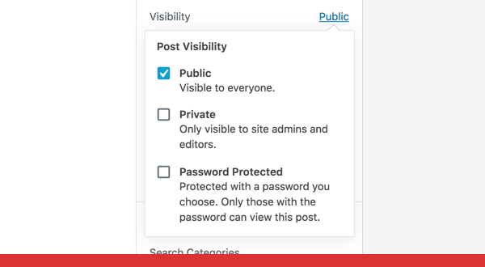

# RadioControl

Use radio buttons when you want users to select one option from a set, and you want to show them all the available options at once.


Selected and unselected radio buttons

## Table of contents

1. [Design guidelines](#design-guidelines)
2. [Development guidelines](#development-guidelines)
3. [Related components](#related-components)

# Design guidelines

## Usage

### When to use radio buttons

Use radio buttons when you want users to:

- Select a single option from a list.
- Expose all available options.

If you have a list of available options can be collapsed, consider using a dropdown menu instead — it uses less space.


**Do**
Use radio buttons when only one item can be selected from a list.


**Don’t**
Don’t use checkboxes when only one item can be selected from a list. Use radio buttons instead.

### Defaults

When using radio buttons **one should be selected by default** (i.e., when the page loads, in the case of a web application).

**User control**

In most interactions, a user should be able to undo and redo their actions. With most selection controls you can un-choose a selection, but in this instance you cannot click or tap a selected radio button to deselect it — selecting is a final action. The finality isn’t conveyed when none are selected by default. Selecting a radio button by default communicates that the user is required to choose one in the set.

**Expediting tasks**

When one a choice in a set of radio buttons is the most desirable or frequently selected, it’s helpful to select it by default. Doing this reduces the interaction cost and can save the user time and clicks.

**The power of suggestion**

Designs with a radio button selected by default make a strong suggestion to the user. It can help them make the best decision and increase their confidence. (Use this guidance with caution, and only for good.)

# Development guidelines

## Usage

Render a user interface to select the user type using radio inputs.

```jsx
import { RadioControl } from '@wordpress/components';
import { withState } from '@wordpress/compose';

const MyRadioControl = withState( {
	option: 'a',
} )( ( { option, setState } ) => ( 
	<RadioControl
		label="User type"
		help="The type of the current user"
		selected={ option }
		options={ [
			{ label: 'Author', value: 'a' },
			{ label: 'Editor', value: 'e' },
		] }
		onChange={ ( option ) => { setState( { option } ) } }
	/>
) );
```

## Props

The component accepts the following props:

### label

If this property is added, a label will be generated using label property as the content.

- Type: `String`
- Required: No

### help

If this property is added, a help text will be generated using help property as the content.

- Type: `String`
- Required: No

### selected

The value property of the currently selected option.

- Type: `Object`
- Required: No

### options

An array of objects containing the following properties:
* `label`: (string) The label to be shown to the user.
* `value`: (Object) The internal value compared against select and passed to onChange.

- Type: `Array`
- Required: No

### onChange

A function that receives the value of the new option that is being selected as input.

- Type: `function`
- Required: Yes

# Related components

* To select one or more items from a set, use the `CheckboxControl` component.
* To toggle a single setting on or off, use the `ToggleControl` component.
